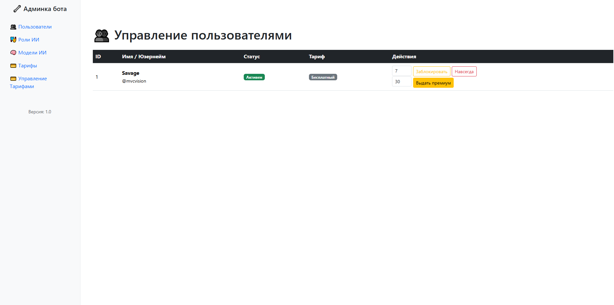
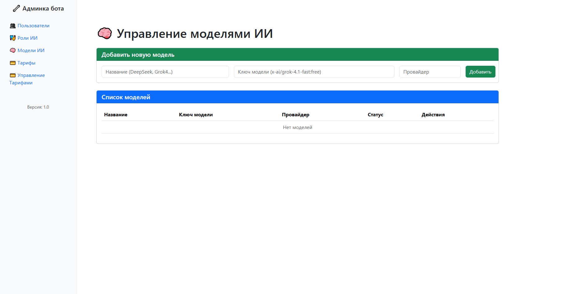
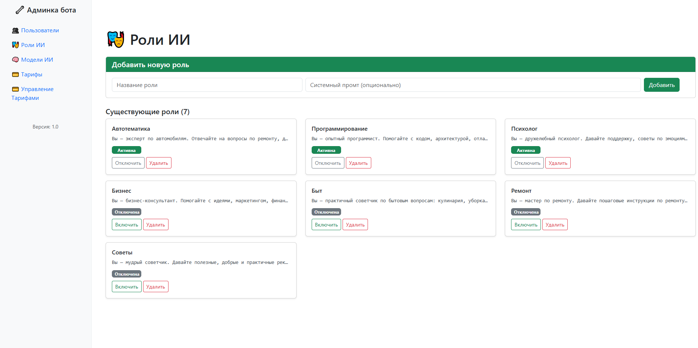
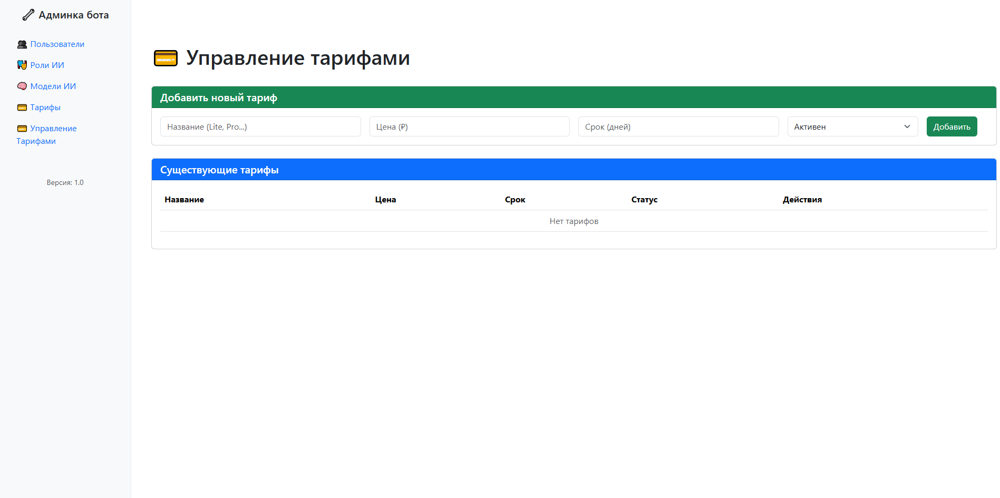
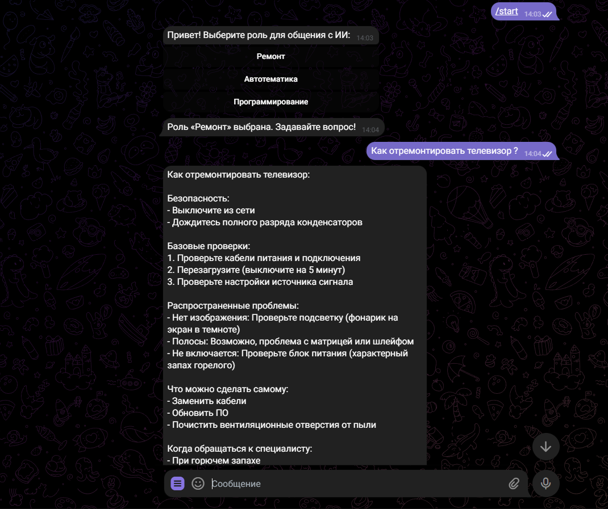

# Telegram AI Bot — Умный чат-бот с ролями и тарифами

Этот проект представляет собой **Интеллектуального Telegram-бота**, интегрированного с [OpenRouter](https://openrouter.ai/), который поддерживает:
- **Роли ИИ** (Психолог, Программист, Бизнес-консультант и др.)
- **Платные тарифы** (Lite / Pro / Profi)
- **Управление пользователями** (блокировка, история диалогов, выдача премиум)
- **Несколько моделей ИИ** с автоматическим переключением при ошибках
- **Управление моделями** (Добавление новых моделей, удаление старых)

Бот сохраняет **историю диалогов**, использует **системные промты** и имеет **полную админку** для управления.

## Технологии

- **Язык**: Java 17+
- **Фреймворк**: Spring Boot 3.x
- **База данных**: MySQL + Hibernate (JPA)
- **Telegram API**: `telegrambots` (Long Polling)
- **ИИ-провайдер**: OpenRouter API
- **Frontend админки**: Thymeleaf + Bootstrap 5
- **Сборка**: Maven

## Зависимости

- Spring Web
- Spring Data JPA
- Spring Boot Starter Thymeleaf
- MySQL Connector
- Telegram Bots API
- Spring WebFlux (для WebClient)

## Основные функции
**Для пользователей**
- /start — выбор роли ИИ
- /help — справка
- Общение с сохранением контекста
- Автоматический переход на резервную модель при ошибках
**Для администратора**
- Управление пользователями (блокировка, просмотр истории)
- Редактирование ролей ИИ (название, системный промт, активность)
- Настройка тарифов (Lite / Pro / Profi)
- Управление моделями ИИ

## Структура проекта
src/
├── main/
│   ├── java/com/example/bot/
│   │   ├── entity/          # JPA-сущности
│   │   ├── repository/      # Репозитории
│   │   ├── service/         # Сервисы
│   │   ├── controller/      # Контроллеры админки
│   │   └── MyTelegramBot.java  # Основной бот
│   └── resources/
│       ├── templates/       # HTML-шаблоны Thymeleaf
│       └── application.properties

## Демонстрация

